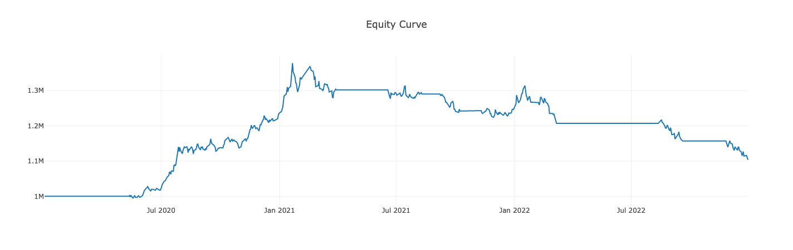
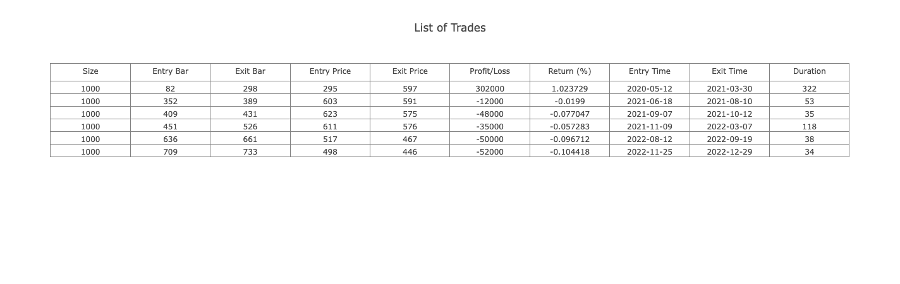

# Fugle Backtest

[![NPM version][npm-image]][npm-url]
[![Build Status][action-image]][action-url]
[![Coverage Status][codecov-image]][codecov-url]

> 一個基於 [Danfo.js](https://github.com/javascriptdata/danfojs) 的 Node.js 交易策略回測工具，靈感來自於 [backtesting.py](https://github.com/kernc/backtesting.py)。

## 安裝

```sh
$ npm install --save @fugle/backtest
```

## 匯入模組

```js
// Using Node.js `require()`
const { Backtest, Strategy } = require('@fugle/backtest');

// Using ES6 imports
import { Backtest, Strategy } from '@fugle/backtest';
```

## 快速開始

以下範例使用 [technicalindicators](https://github.com/anandanand84/technicalindicators) 來計算指標和信號，但您可以使用任何函式庫進行替換。

```js
import { Backtest, Strategy } from '@fugle/backtest';
import { SMA, CrossUp, CrossDown } from 'technicalindicators';

class SmaCross extends Strategy {
  params = { n1: 20, n2: 60 };

  init() {
    const lineA = SMA.calculate({
      period: this.params.n1,
      values: this.data['close'].values,
    });
    this.addIndicator('lineA', lineA);

    const lineB = SMA.calculate({
      period: this.params.n2,
      values: this.data['close'].values,
    });
    this.addIndicator('lineB', lineB);

    const crossUp = CrossUp.calculate({
      lineA: this.getIndicator('lineA'),
      lineB: this.getIndicator('lineB'),
    });
    this.addSignal('crossUp', crossUp);

    const crossDown = CrossDown.calculate({
      lineA: this.getIndicator('lineA'),
      lineB: this.getIndicator('lineB'),
    });
    this.addSignal('crossDown', crossDown);
  }

  next(ctx) {
    const { index, signals } = ctx;
    if (index < this.params.n1 || index < this.params.n2) return;
    if (signals.get('crossUp')) this.buy({ size: 1000 });
    if (signals.get('crossDown')) this.sell({ size: 1000 });
  }
}

const data = require('./data.json');  // historical OHLCV data

const backtest = new Backtest(data, TestStrategy, {
  cash: 1000000,
  tradeOnClose: true,
});

backtest.run()        // run the backtest
  .then(results => {
    results.print();  // print the results
    results.plot();   // plot the equity curve
  });
```

回測結果：

```
╔════════════════════════╤═══════════════════════╗
║ Strategy               │ SmaCross(n1=20,n2=60) ║
╟────────────────────────┼───────────────────────╢
║ Start                  │ 2020-01-02            ║
╟────────────────────────┼───────────────────────╢
║ End                    │ 2022-12-30            ║
╟────────────────────────┼───────────────────────╢
║ Duration               │ 1093                  ║
╟────────────────────────┼───────────────────────╢
║ Exposure Time [%]      │ 55.102041             ║
╟────────────────────────┼───────────────────────╢
║ Equity Final [$]       │ 1105000               ║
╟────────────────────────┼───────────────────────╢
║ Equity Peak [$]        │ 1378000               ║
╟────────────────────────┼───────────────────────╢
║ Return [%]             │ 10.5                  ║
╟────────────────────────┼───────────────────────╢
║ Buy & Hold Return [%]  │ 32.300885             ║
╟────────────────────────┼───────────────────────╢
║ Return (Ann.) [%]      │ 3.482537              ║
╟────────────────────────┼───────────────────────╢
║ Volatility (Ann.) [%]  │ 8.204114              ║
╟────────────────────────┼───────────────────────╢
║ Sharpe Ratio           │ 0.424487              ║
╟────────────────────────┼───────────────────────╢
║ Sortino Ratio          │ 0.660431              ║
╟────────────────────────┼───────────────────────╢
║ Calmar Ratio           │ 0.175785              ║
╟────────────────────────┼───────────────────────╢
║ Max. Drawdown [%]      │ -19.811321            ║
╟────────────────────────┼───────────────────────╢
║ Avg. Drawdown [%]      │ -2.241326             ║
╟────────────────────────┼───────────────────────╢
║ Max. Drawdown Duration │ 708                   ║
╟────────────────────────┼───────────────────────╢
║ Avg. Drawdown Duration │ 54                    ║
╟────────────────────────┼───────────────────────╢
║ # Trades               │ 6                     ║
╟────────────────────────┼───────────────────────╢
║ Win Rate [%]           │ 16.666667             ║
╟────────────────────────┼───────────────────────╢
║ Best Trade [%]         │ 102.3729              ║
╟────────────────────────┼───────────────────────╢
║ Worst Trade [%]        │ -10.4418              ║
╟────────────────────────┼───────────────────────╢
║ Avg. Trade [%]         │ 5.718878              ║
╟────────────────────────┼───────────────────────╢
║ Max. Trade Duration    │ 322                   ║
╟────────────────────────┼───────────────────────╢
║ Avg. Trade Duration    │ 100                   ║
╟────────────────────────┼───────────────────────╢
║ Profit Factor          │ 2.880822              ║
╟────────────────────────┼───────────────────────╢
║ Expectancy [%]         │ 11.139483             ║
╟────────────────────────┼───────────────────────╢
║ SQN                    │ 0.305807              ║
╚════════════════════════╧═══════════════════════╝
```




## 使用方式

為了進行回測，您需要準備歷史數據，並且編寫交易策略，再對該策略進行回測以獲得結果。

### 準備歷史數據

首先，請準備任意金融商品（如：股票、期貨、外匯、加密貨幣等）的 OHLCV（開盤價、最高價、最低價、收盤價、成交量）歷史數據。輸入的歷史資料將會轉換為 Danfo.js [DataFrame](https://danfo.jsdata.org/api-reference/dataframe) 格式，資料格式可以是以下 `Array<Candle>` 或 `CandleList` 類型：

```ts
interface Candle {
  date: string;
  open: number;
  high: number;
  low: number;
  close: number;
  volume?: number;
}

interface CandleList {
  date: string[];
  open: number[];
  high: number[];
  low: number[];
  close: number[];
  volume?: number[];
}

type HistoricalData = Array<Candle> | CandleList;
```

### 實作交易策略

您可以依照自己的想法編寫交易策略。實作交易策略需要繼承 `Strategy` 類別並覆寫其兩個抽象方法：

- `Strategy.init()`：該方法在運行策略之前被調用，您可以預先計算策略所依賴的所有指標和信號。
- `Strategy.next(context)`：該方法將在 `Backtest` 實例運行策略時迭代調用， `context` 參數代表當前的 K 棒以及技術指標和信號。您可以依據當前價格、指標和信號決定是否作出買賣動作。

以下是一個實現簡單移動平均線策略的例子。該策略將均線參數 `period` 預設為 `20`，當股票或商品的收盤價格向上穿越均線時買進 1 交易單位。相反地，當收盤價格向下穿越均線時，該策略會賣出 1 交易單位。

```js
import { Backtest, Strategy } from '@fugle/backtest';
import { SMA, CrossUp, CrossDown } from 'technicalindicators';

class SmaStrategy extends Strategy {
  params = { period: 20 };

  init() {
    const sma = SMA.calculate({
      period: this.params.period,
      values: this.data['close'].values,
    });
    this.addIndicator('SMA', sma);

    const crossUp = CrossUp.calculate({
      lineA: this.data['close'].values,
      lineB: this.getIndicator('SMA'),
    });
    this.addSignal('CrossUp', crossUp);

    const crossDown = CrossDown.calculate({
      lineA: this.data['close'].values,
      lineB: this.getIndicator('SMA'),
    });
    this.addSignal('CrossDown', crossDown);
  }

  next(ctx) {
    const { index, signals } = ctx;
    if (index === 0) this.buy({ size: 1000 });
    if (index < 60) return;
    if (signals.get('CrossDown')) this.sell({ size: 1000 });
    if (signals.get('CrossUp')) this.buy({ size: 1000 });
  }
}
```

### 運行回溯測試

準備好歷史數據並實作交易策略後，就可以運行回溯測試。調用 `Backtest.run()` 方法會執行回溯測試並回傳 `Stats` 物件，其中包含我們策略的模擬結果和相關的統計數據。


```js
const backtest = new Backtest(data, SmaStrategy, {
  cash: 1000000,
  tradeOnClose: true,
});

backtest.run()        // run the backtest
  .then(results => {
    results.print();  // print the results
    results.plot();   // plot the equity curve
  });
```

### 最佳化參數

在上述策略中，我們提供的兩個可變參數 `params.n1` 與 `params.n2`，代表兩條移動平均線的期間。我們可以透過調用 `Backtest.optimize()` 方法來最佳化參數，並找出多個參數的最佳組合。在該方法下設置 `params` 選項可以改變 `Strategy` 提供參數的設定，`Backtest.optimize()` 將會回傳提供參數下的最佳組合。

```js
backtest.optimize({
  params: {
    n1: [5, 10, 20],
    n2: [60, 120, 240],
  },
})
  .then(results => {
    results.print();  // print out the results of the optimized parameters
    results.plot();   // plot the equity curve of the optimized parameters
  });
```

## 文件

關於 `@fugle/backtest` 用法的詳細說明，請至 [`/doc/fugle-backtest-zh-TW.md`](./doc/fugle-backtest-zh-TW.md) 查閱。

## 授權

[MIT](LICENSE)

[npm-image]: https://img.shields.io/npm/v/@fugle/backtest.svg
[npm-url]: https://npmjs.com/package/@fugle/backtest
[action-image]: https://img.shields.io/github/actions/workflow/status/fugle-dev/fugle-backtest-node/node.js.yml?branch=master
[action-url]: https://github.com/fugle-dev/fugle-backtest-node/actions/workflows/node.js.yml
[codecov-image]: https://img.shields.io/codecov/c/github/fugle-dev/fugle-backtest-node.svg
[codecov-url]: https://codecov.io/gh/fugle-dev/fugle-backtest-node
