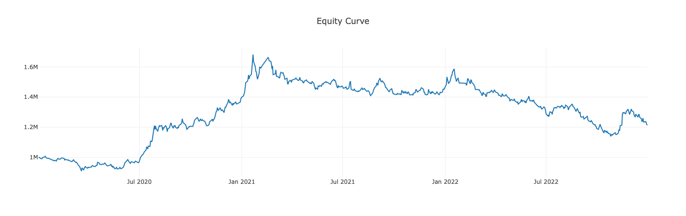

# Fugle Backtest

[![NPM version][npm-image]][npm-url]
[![Build Status][action-image]][action-url]
<!-- [![Coverage Status][codecov-image]][codecov-url] -->

> Backtest trading strategies in Node.js

## Installation

```sh
$ npm install --save @fugle/backtest
```

## Importing

```js
// Using Node.js `require()`
const { Backtest, Strategy } = require('@fugle/backtest');

// Using ES6 imports
import { Backtest, Strategy } from '@fugle/backtest';
```

## Quick Start

The following example use [technicalindicators](https://github.com/anandanand84/technicalindicators) to calculate the indicators and signals, but you can replace it with any library.


```js
import { Backtest, Strategy } from '@fugle/backtest';
import { SMA, CrossUp, CrossDown } from 'technicalindicators';

class TestStrategy extends Strategy {
  init() {
    const sma60 = SMA.calculate({
      period: 60,
      values: this.data['close'].values,
    });
    this.addIndicator('SMA60', sma60);

    const crossUp = CrossUp.calculate({
      lineA: this.data['close'].values,
      lineB: this.getIndicator('SMA60'),
    });
    this.addSignal('CrossUp', crossUp);

    const crossDown = CrossDown.calculate({
      lineA: this.data['close'].values,
      lineB: this.getIndicator('SMA60'),
    });
    this.addSignal('CrossDown', crossDown);
  }

  next(ctx) {
    const { index, signals } = ctx;
    if (index === 0) this.buy({ size: 1000 });
    if (index < 60) return;
    if (signals.get('CrossDown')) this.sell({ size: 1000 });
    if (signals.get('CrossUp')) this.buy({ size: 1000 });
  }
}

const data = require('./data.json');  // historical OHLCV data

const backtest = new Backtest(data, TestStrategy, {
  cash: 1000000,
  tradeOnClose: true,
});

backtest
  .run()    // run the backtest
  .print()  // print the results
  .plot();  // plot the equity curve
```

Results in:

```
╔════════════════════════╤════════════╗
║ Start                  │ 2020-01-02 ║
╟────────────────────────┼────────────╢
║ End                    │ 2022-12-30 ║
╟────────────────────────┼────────────╢
║ Duration               │ 1093       ║
╟────────────────────────┼────────────╢
║ Exposure Time [%]      │ 99.863946  ║
╟────────────────────────┼────────────╢
║ Equity Final [$]       │ 1216000    ║
╟────────────────────────┼────────────╢
║ Equity Peak [$]        │ 1682500    ║
╟────────────────────────┼────────────╢
║ Return [%]             │ 21.6       ║
╟────────────────────────┼────────────╢
║ Buy & Hold Return [%]  │ 32.300885  ║
╟────────────────────────┼────────────╢
║ Return (Ann.) [%]      │ 6.935051   ║
╟────────────────────────┼────────────╢
║ Volatility (Ann.) [%]  │ 17.450299  ║
╟────────────────────────┼────────────╢
║ Sharpe Ratio           │ 0.397417   ║
╟────────────────────────┼────────────╢
║ Sortino Ratio          │ 0.660789   ║
╟────────────────────────┼────────────╢
║ Calmar Ratio           │ 0.215082   ║
╟────────────────────────┼────────────╢
║ Max. Drawdown [%]      │ -32.243685 ║
╟────────────────────────┼────────────╢
║ Avg. Drawdown [%]      │ -4.486974  ║
╟────────────────────────┼────────────╢
║ Max. Drawdown Duration │ 708        ║
╟────────────────────────┼────────────╢
║ Avg. Drawdown Duration │ 66         ║
╟────────────────────────┼────────────╢
║ # Trades               │ 32         ║
╟────────────────────────┼────────────╢
║ Win Rate [%]           │ 18.75      ║
╟────────────────────────┼────────────╢
║ Best Trade [%]         │ 95.9184    ║
╟────────────────────────┼────────────╢
║ Worst Trade [%]        │ -10.3245   ║
╟────────────────────────┼────────────╢
║ Avg. Trade [%]         │ 1.847315   ║
╟────────────────────────┼────────────╢
║ Max. Trade Duration    │ 308        ║
╟────────────────────────┼────────────╢
║ Avg. Trade Duration    │ 53         ║
╟────────────────────────┼────────────╢
║ Profit Factor          │ 2.293327   ║
╟────────────────────────┼────────────╢
║ Expectancy [%]         │ 3.230916   ║
╟────────────────────────┼────────────╢
║ SQN                    │ 0.579594   ║
╚════════════════════════╧════════════╝
```




## License

[MIT](LICENSE)

[npm-image]: https://img.shields.io/npm/v/@fugle/backtest.svg
[npm-url]: https://npmjs.com/package/@fugle/backtest
[action-image]: https://img.shields.io/github/actions/workflow/status/fugle-dev/fugle-backtest-node/node.js.yml?branch=master
[action-url]: https://github.com/fugle-dev/fugle-backtest-node/actions/workflows/node.js.yml
<!-- [codecov-image]: https://img.shields.io/codecov/c/github/fugle-dev/fugle-backtest-node.svg
[codecov-url]: https://codecov.io/gh/fugle-dev/fugle-backtest-node -->
